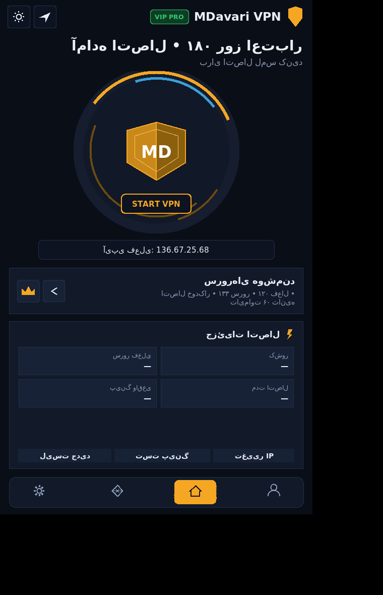
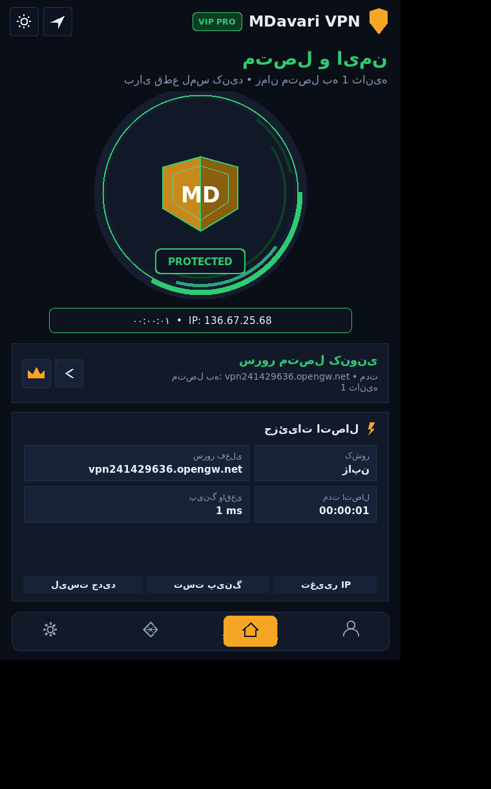
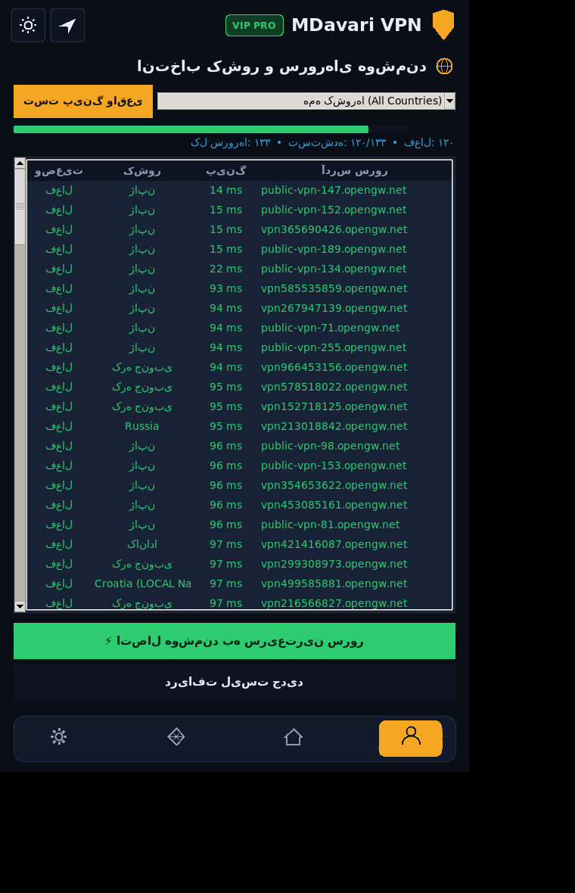
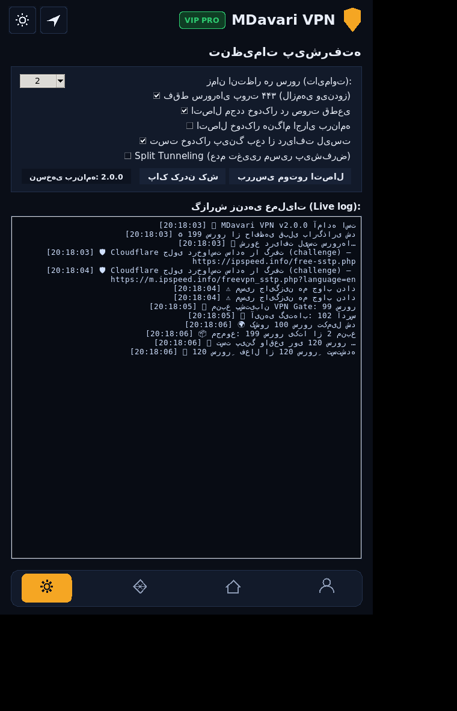

# MDavari VPN PRO — نسخه ۲ 🛡

کلاینت هوشمند SSTP برای ویندوز و اندروید — با موتور بومی ویندوز، چند منبع دریافت سرور، تست پینگ واقعی و اتصال خودکار.

> **شناسه برنامه:** `MDavariVPN v2.0.0` · بدون هیچ وابستگی خارجی (فقط پایتون استاندارد) · تم دارک/لایت · رابط فارسی

## وضعیت فعلی (تست‌شده در همین لحظه)

| بخش | وضعیت |
|---|---|
| دریافت لیست سرور | ✅ **۱۹۹ سرور یکتا** از ۲ منبع در تست واقعی (Cloudflare جلوی سایت را گرفت → منابع پشتیبان جایگزین شدند) |
| پینگ واقعی | ✅ ۳۰ از ۳۰ سرور اول پاسخ دادند (۹۴ تا ۱۱۹ میلی‌ثانیه از اینترنت تست) |
| موتور SSTP ویندوز | ✅ ساخته شده (PowerShell + rasdial + چک سریع وضعیت با ipconfig) — روی ویندوز خودت تست می‌شود |
| ماشین حالت (اتصال/قطعی/اتصال مجدد/تغییر IP) | ✅ تست یکپارچه: اتصال → قطعی مصنوعی → اتصال مجدد خودکار → تغییر IP |
| رابط کاربری | ✅ چهار صفحه (خانه، سرورها، خرید، تنظیمات) + لاگ زنده + تم تاریک/روشن |
| اپ اندروید (فاز A) | ✅ کد کامل + همه‌ی XMLها اعتبارسنجی شد؛ APK با ورک‌فلوی گیت‌هاب ساخته می‌شود |

### تصاویر (از محیط تست لینوکس)
> توجه: این تصاویر در لینوکس گرفته شده‌اند و Tk در X11 حروف فارسی را به‌هم نمی‌چسباند؛
> **روی ویندوز متن‌های فارسی کاملاً درست و چسبیده نمایش داده می‌شوند.** هدف تصاویر، نشان دادن چیدمان است.

| خانه | متصل | سرورها | تنظیمات + لاگ زنده |
|---|---|---|---|
|  |  |  |  |

---

## ۱) اجرای سریع روی ویندوز

فقط به **پایتون ۳.۱۰ یا بالاتر** نیاز است (هنگام نصب تیک `Add python.exe to PATH` را بزن).

```
روش ساده: روی run.bat دابل‌کلیک کن
روش دستی: python main.py
```

پنجره‌ی برنامه باز می‌شود:
- دکمه‌ی بزرگ **START VPN** → خودش لیست می‌گیرد، پینگ می‌گیرد و به بهترین سرور وصل می‌شود
- تب **سرورها** (آیکون شخص): لیست کامل + فیلتر کشور + پینگ واقعی + دو‌بار کلیک برای اتصال
- تب **تنظیمات** (چرخ‌دنده): تایم‌اوت، اتصال مجدد خودکار، Split Tunneling، **لاگ زنده**
- تب **خرید** (الماس): نمایشی — QR/آدرس TRC20 + کد دستگاه + دکمه‌ی پشتیبانی

---

## ۲) گرفتن فایل اجرایی `MDavariVPN.exe` از گیت‌هاب (بدون نصب چیزی روی سیستم)

1. یک مخزن (ریپازیتوری) جدید و **Public** در گیت‌هاب بساز و کل محتوای این پوشه را در آن آپلود کن.
2. به تب **Actions** برو → ورک‌فلوی `build-windows-exe` → دکمه‌ی **Run workflow**.
3. بعد از ۲ تا ۴ دقیقه، پایین صفحه‌ی اجرای ورک‌فلو در بخش **Artifacts** فایل `MDavariVPN-windows` را دانلود کن.
4. فایل zip را باز کن → `MDavariVPN.exe` را اجرا کن. **تمام** (هیچ نصبی لازم نیست).

> ورک‌فلو بعد از هر تغییر در کد هم خودکار اجرا می‌شود.

نسخه‌ی محلی exe: `build_exe.bat` را روی ویندوز خودت اجرا کن (PyInstaller را خودش نصب می‌کند).

---

## ۳) چطور کار می‌کند (معماری)

### الف) گرفتن سرورها — چندلایه و ضد‌خطا
| ترتیب | منبع | توضیح |
|---|---|---|
| ۱ | `ipspeed.info/free-sstp.php` | خودِ سایتی که خواستی، با هدرهای واقعی مرورگر |
| ۲ | `r.jina.ai` (پروکسی خواندنی) | اگر سایت مستقیم جواب ندهد |
| ۳ | **مرورگر هدلس Edge** (فقط ویندوز) | برای عبور از چالش Cloudflare؛ نتیجه‌ی DOM خوانده می‌شود |
| ۴ | **API رسمی VPN Gate** | همان شبکه‌ی سرورها (`*.opengw.net`) |
| ۵ | **آینه‌های گیت‌هاب** | همان لیست SSTP که به‌روز نگه داشته می‌شود |
| ۶ | **کش محلی** | آخرین لیست موفق تا برنامه هرگز دست‌خالی نماند |

> **واقعیت مهم:** سایت `ipspeed.info` پشت **Cloudflare Challenge** است. تست کردم و درخواست ساده با کد `403 Just a moment` رد می‌شود (دقیقاً همان خطای لاگ نسخه‌ی قبلی برنامه). پس این معماری چندمنبعی، جواب عملی همین مشکل است. اگر روی کامپیوتر خودت سایت را باز کرده باشی، مسیر مهٔ هدلس Edge خیلی وقت‌ها چالش را رد می‌کند.

### ب) تست پینگ واقعی
به‌جای اعتماد به پینگ سایت، خود برنامه در **۶۴ نخ هم‌زمان** اتصال TCP به پورت سرور را می‌گیرد و زمان واقعی را می‌سنجد → فقط سرورهای زنده در صدر لیست می‌آیند.

### ج) موتور اتصال روی ویندوز = **SSTP بومی ویندوز**
- بدون درایور، بدون نصب ابزار جانبی، بدون FiveM/OpenVPN، همان قابلیت داخلی ویندوز.
- مسیر اصلی: `PowerShell` (ساخت پروفایل) + `rasdial` (اتصال با `vpn/vpn`)
- **نکته‌ی گواهی:** سرورها گواهی معتبر **Let's Encrypt** (`*.opengw.net`) دارند؛ بنابراین نیازی به نصب گواهی SSL نیست. ✅ (تست شده)
- اتصال چند‌باره: اگر سرور اول وصل نشد، تا ۶ سرور بعدی **به‌ترتیب بهترین پینگ** امتحان می‌شوند.

### د) وضعیت‌ها و اتصال مجدد
مراقب پس‌زمینه هر ۴ ثانیه وضعیت تونل را چک می‌کند؛ اگر قطع شد، خودکار به سرور بعدی وصل می‌شود و IP را در نوار پایین به‌روز می‌کند.

---

## ۴) محدودیت‌های واقعی (شفاف)

| موضوع | واقعیت |
|---|---|
| پورت سرورها | ویندوز فقط **پورت ۴۴۳** را برای SSTP قبول می‌کند. گزینه‌ی «فقط سرورهای پورت ۴۴۳» پیش‌فرض روشن است (به‌صورت پیش‌فرض لیست فقط شامل همان‌ها می‌شود). |
| سرعت | سرورها عمومی و مشترک‌اند؛ بعضی ساعت‌ها شلوغ می‌شوند. |
| تفاوت پینگ | پینگ کم ≠ سرعت خوب. اگر سرعت پایین بود سرور دیگری را تست کن. |
| شناسایی توسط سرویس‌ها | سرورهای رایگان توسط بعضی سایت‌ها (گوگل/بنک) بلاک می‌شوند؛ برای کارهای بانکی استفاده نکن. |
| دسترسی مستقیم به سایت | اگر Cloudflare جلوی همه‌ی مسیرها را گرفت، برنامه از منبع پشتیبان (همان سرورها) استفاده می‌کند؛ نتیجه از نظر عمل یکی است. |
| دامنه‌ی مسئولیت | این برنامه برای **استفاده‌ی شخصی از اینترنت آزاد** ساخته شده؛ قوانین محل خودت را رعایت کن. |

---

## ۵) تنظیمات مهم

| کلید | پیش‌فرض | کار |
|---|---|---|
| `ping_timeout` | 2 ثانیه | تایم‌اوت تست هر سرور |
| `ping_top` | 120 | چند سرور اول پینگ شوند (۰ = همه) |
| `only_port_443` | روشن | فقط سرورهای سازگار با ویندوز |
| `auto_reconnect` | روشن | وصل شدن خودکار پس از قطعی |
| `connect_on_start` | خاموش | اتصال خودکار هنگام باز شدن برنامه |
| `split_tunneling` | خاموش | خاموش = کل ترافیک از تونل (توصیه‌شده) |
| `theme` | dark | تم دارک/لایت |

فایل‌های برنامه: `%APPDATA%\MDavariVPN\` → `settings.json`، `servers_cache.json`، `mdavari.log`، `device_id.txt`

---

## ۶) عیب‌یابی سریع

| نشانه | راه‌حل |
|---|---|
| `Python not found` | پایتون ۳ را با تیک PATH نصب کن |
| سایت `403` می‌دهد (لاگ) | طبیعی است؛ منبع پشتیبان خودکار کار می‌کند. برای مسیر هدلس، یک‌بار Edge را باز کن و به سایت برو |
| اتصال با خطای `800/809` می‌خورد | سرور فیلتر یا خاموش است؛ برنامه خودش سرور بعدی را امتحان می‌کند |
| خطای `691` | نام/رمز `vpn/vpn` توسط سرور رد شده؛ سرور بعدی |
| `789` یا `720` | خطای امنیتی/PPP همان سرور؛ سرور بعدی |
| پنجره‌ی UAC می‌آید | طبیعی است، فقط اولین بار برای ساخت پروفایل VPN؛ تأیید کن |
| سرعت افتاده | لیست جدید بگیر و از سرور پینگ‌پایینِ تازه استفاده کن |
| IP عوض نشده | ۲۰ ثانیه صبر کن یا دکمه‌ی «تغییر IP» را بزن |

---

## ۷) ساختار پروژه

```
MDavariVPN/
├── main.py                     نقطه‌ی شروع (+ --selftest / --connect-best / --screenshot)
├── run.bat                     اجرا روی ویندوز
├── build_exe.bat               ساخت exe محلی
├── app/
│   ├── config.py               تنظیمات، مسیرها، ابزار فارسی
│   ├── sources.py              منابع سرور + پارسر + کش  (۶ لایه)
│   ├── pinger.py               پینگ TCP موازی + گرفتن IP
│   ├── engine.py               موتور SSTP ویندوز (PowerShell + rasdial) + Mock
│   ├── controller.py           مغز برنامه (threading + صف رویداد)
│   └── ui/                     theme · widgets (سپر/نوار پایین/آیکون‌ها) · pages · app
├── android/                    ← فاز ۲: اپ اندروید (در حال ساخت)
└── .github/workflows/          ← ساخت خودکار exe و APK
```

---

## ۸) خودآزمایی بدون رابط گرافیکی

```bash
python main.py --selftest      # لیست + پینگ + IP را چاپ می‌کند
python main.py --connect-best  # سریع‌ترین سرور را پیدا و وصل می‌شود (ویندوز)
```

---

## ۹) فاز اندروید (در حال انجام)

اندروید SSTP داخلی ندارد؛ مسیر انتخابی تو:
1. **اپ کمکی هوشمند (اکنون):** همان UI، لیست/پینگ/بهترین سرور + ساخت پروفایل OpenVPN همان سرور و پاس دادن به اپ OpenVPN برای اتصال یک‌لمسی.
2. **اپ مستقل (مرحله‌ی بعد):** پیاده‌سازی تونل با `VpnService`.
